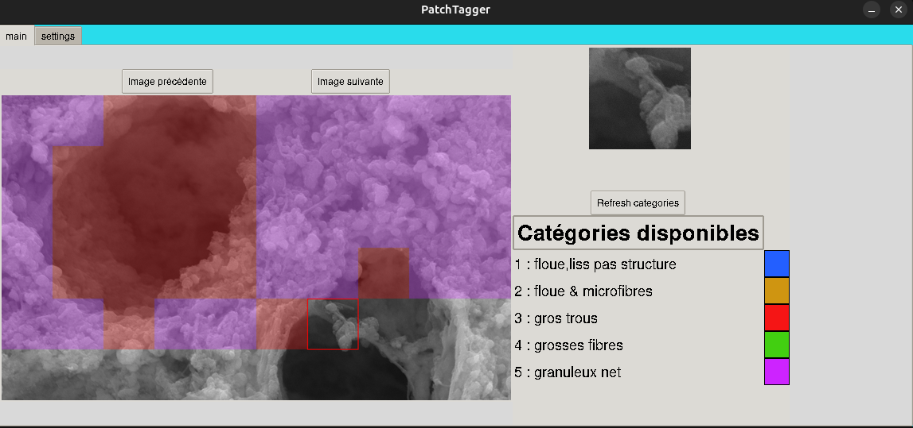

# PatchTagger

PatchTagger is a simple tool to classify patches.
<p align="center">
  
</p>


## Start with PatchTagger

### Installation 
First, create a conda environment and install required dependencies : 


```bash 
conda env create -f requirements.yaml --name PatchTagger
conda activate PatchTagger
``` 


### Run Patchtagger


```bash 
python PatchTagger.py
``` 


## PatchTagger usage 

### Data preprocessing

All images must be located in the same folder, with .tif extension, and cropped in 768x1280 pixels.

### Settings 

Before starting, need to set up : 

1. **Output folder** : a new folder (called PatchTagger_Output) will be created in it if needed. If **PatchTagger_Output** already exists in the specified folder, the previous classification will be reused.

2. **Data folder** : where all the images are stored.

3. **Add categories if needed** : select the color, and enter the class description. Refresh the categories in the **main** frame.


### Start the classification 

You can change the image the classify using the buttons, and change patchs with keyboard arrows    $\leftarrow  \rightarrow $. Then, you can select the class for each patch pressing the right number on the keyboard. Everything will be saved automatically.


### Contact
You can contact me at : 


adrien.bouchet@agroparistech.fr


